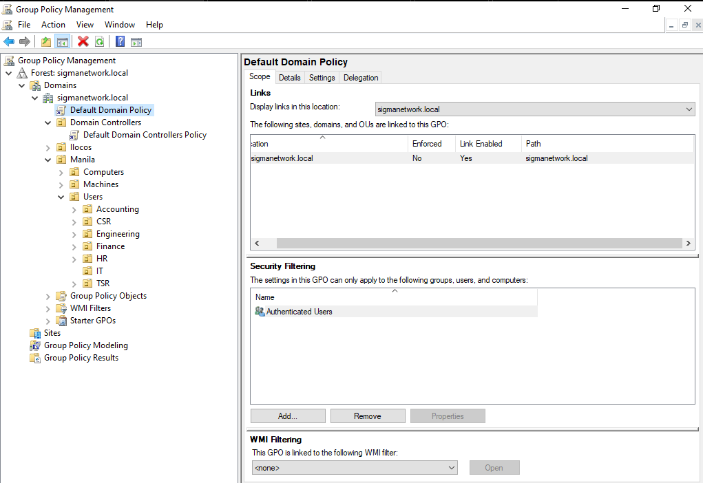
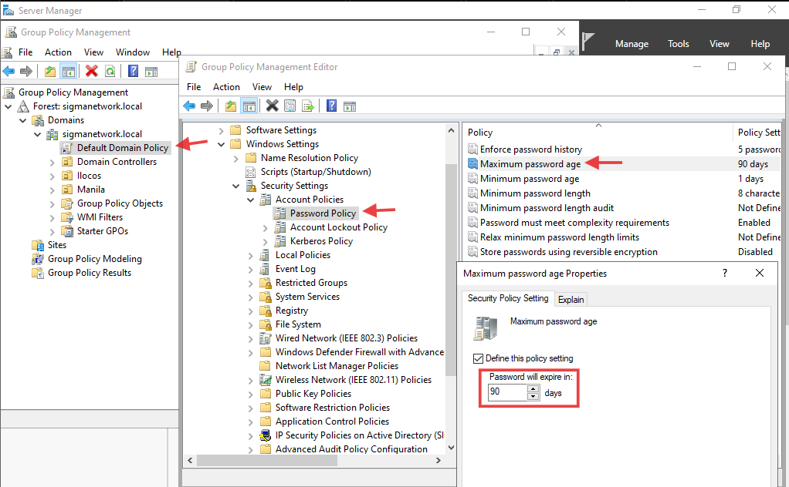
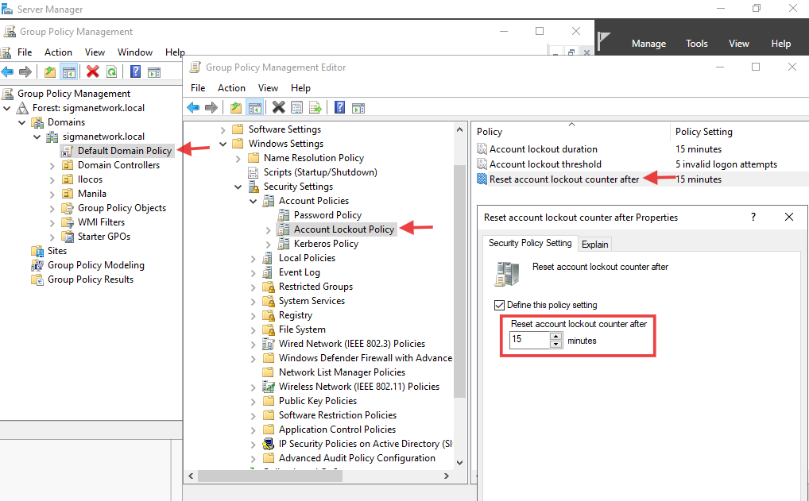
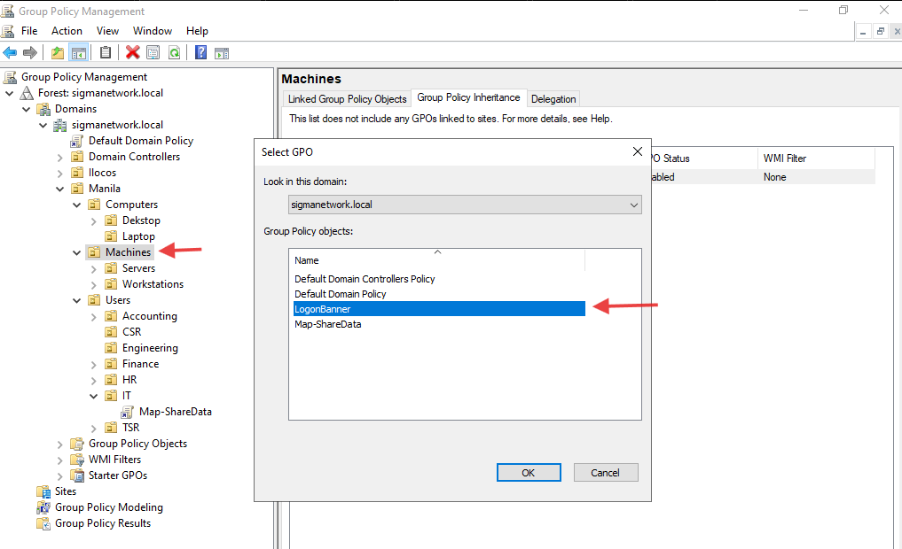
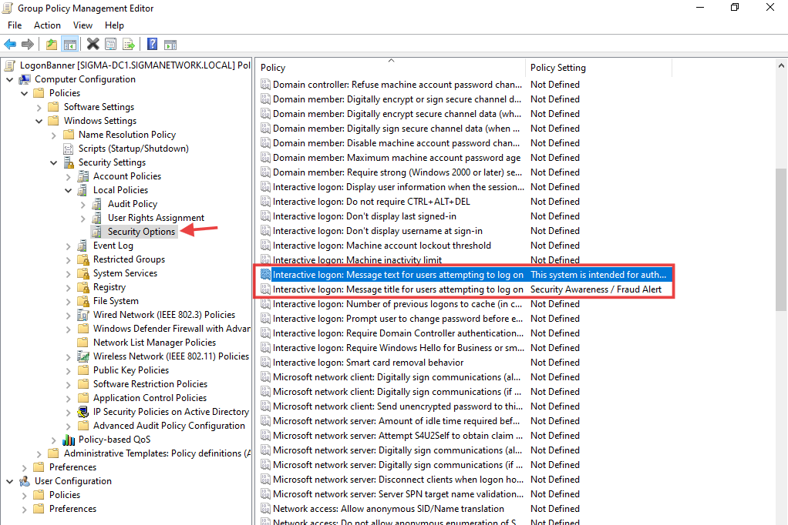
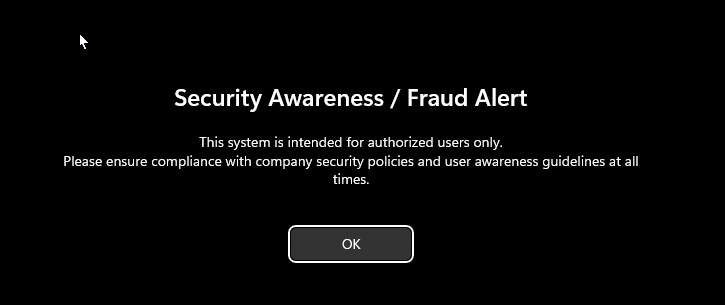

# Project 03: Group Policy Testing
*Applying and validating Group Policy Objects (GPOs) for security and configuration.*
> Showcases enterprise-level automation with Group Policy, including password policies, drive mappings, and compliance settings.
---

## Tasks Completed

### 1. Configured Password Policies (Domain-wide)
- Edited **Default Domain Policy** in GPMC
- Applied the following settings:
  - Minimum length: **8 characters**
  - Complexity: **Enabled** (uppercase, lowercase, number, symbol)
  - Maximum age: **90 days**
  - Password history: **5 remembered**
  - Account lockout threshold: **5 invalid attempts**
- Tested by creating a weak password for a user → **rejected as expected**

### 2. Drive Mapping via GPO
- Created a new GPO: **Map-SharedData**
- Configured **Group Policy Preferences → Drive Maps**
- Mapped `\\SIGMA-SVR1\ShareData` as drive **Z:**
- Applied to **IT-Users** and **CSR** groups
- Verified by logging in as **jap.albornoz** → drive mapped automatically

### 3. Logon Banner                               
- Configured **Interactive Logon Message** via GPO
- Added a compliance/welcome banner for all domain users
- Tested by logging in on **SIGMA-USER-W11** → banner displayed before desktop

<!-- 
TODO: these are reserved and later can be input
- ### adding a 4. Folder Redirection using Group Policy 
-  Group Policy Management Console (GPMC)
-->

---

## GPO Implementation & Validation
The following screenshots demonstrate the configuration steps and verification of applied Group Policy Objects in an Active Directory domain environment.                        
- GPMC showing **Default Domain Policy** and custom GPOs          
  
  
- Configured Password and Account Lockout Policies
  
  
  
- Drive **Z:** mapped automatically for IT-Users group                                
  
  
  
  
  
  
  
- Logon banner displayed at user login                                                                 
  
  
  
---

## Lessons Learned            
- GPOs apply at the **OU level**, so OU design directly impacts policy targeting
- **Default Domain Policy** should be used for domain-wide security baselines
- **Group Policy Preferences** automate common tasks (drive mapping, printers, shortcuts)
- Testing with different user accounts validates correct policy application
- GPOs enable **enterprise-scale automation** consistent, repeatable, and efficient

