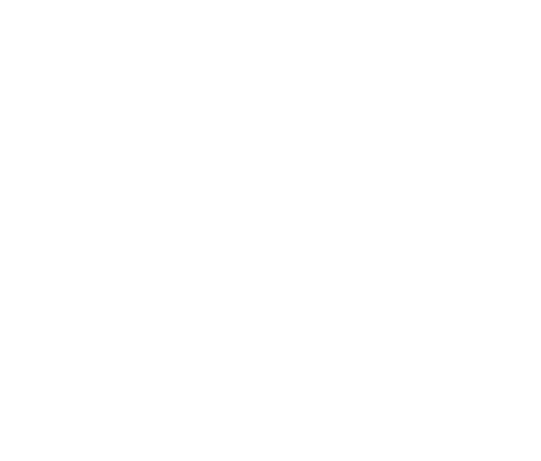
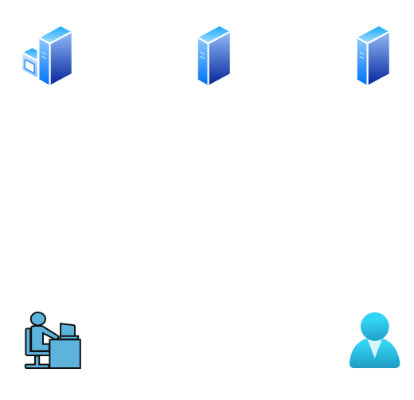

# Project 01: Active Directory Domain Setup

This project documents the setup of a Windows Server 2022 Domain Controller in a fully isolated lab environment using VMware Workstation Pro.

---

## 🧱 Lab Architecture

- **Virtualization Platform**: VMware Workstation Pro
- **Operating Systems**: Windows Server 2022, Windows 11 Enterprise 
- **Network Type**: Host-only (VMnet1)

---

## 🔧 Setup Steps

A. VMWare Workstation Pro: Set up the five Virtual Machines
-  Installed Windows Server 2022 on SIGMA-DC1, SIGMA-SVR1, SIGMA-CORE
-  Installed Windows 11 (Enterprise) on ITSUPP and USER

B. Virtual Machine 1: SIGMA-DC1 Setup 
-  SIGMA-DC1 network configuration, static IP: `192.168.0.254`, no gateway, DNS = self
-  Installed AD DS, DNS, DHCP, Group Policy Management via Server Manager roles and features
-  Promoted SIGMA-DC1 to a domain controller (`sigmanetwork.local`)

B. Virtual Machine 2: SIGMA-SVR Setup
-  SIGMA-SVR network configuration, static IP: `192.168.0.253`, no gateway, DNS: `192.168.0.254`
-  Joined the domain (sigmanetwork)
  
C. Virtual Machine 3: SIGMA-CORE Setup
-  SIGMA-SVR network configuration, static IP: `192.168.0.252`, no gateway, DNS: `192.168.0.254`
-  Joined the domain (sigmanetwork)

D. Virtual Machine 4: SIGMA-ITSUPP Setup
-  SIGMA-SVR network configuration, static IP: `192.168.0.241`, no gateway, DNS: `192.168.0.254`
-  Joined the domain (sigmanetwork)

E. Virtual Machine 5: SIGMA-USER Setup
-  SIGMA-SVR network configuration, static IP: `192.168.0.1`, no gateway, DNS: `192.168.0.254`
-  Joined the domain (sigmanetwork)  

F. Verified domain functionality and DNS resolution

---

## 📸 Screenshots
- [x] Server Manager Role Installation  
- [x] Domain Promotion Wizard  
- [x] Successful domain join (SVR1, CORE, ITSUPP, USER)  
- [x] DNS zone configuration

---

## 🧠 Lessons Learned

- DNS must point to the DC during domain join  
- Manual IP setup avoids DHCP conflicts  
- Segmenting IP ranges improves clarity and future GPO targeting  
- Host-only VMnet ensures full isolation from the real network
  
---

## 🚀 Next Steps

- Create and apply Group Policy Objects by role  
- Add DNS forwarders and test external name resolution  
- Document troubleshooting scenarios (e.g., failed domain join, replication issues)
